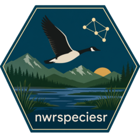

<!-- badges: start -->

<!-- For more info: https://usethis.r-lib.org/reference/badges.html -->

[](https://lifecycle.r-lib.org/articles/stages.html#experimental)

<!-- badges: end -->

# nwrspeciesr <a href="https://usfws.github.io/nwrspeciesr/"></a>


## Overview

**nwrspeciesr** is an R interface to the U.S. Fish and Wildlife Service
National Wildlife Refuge System species occurrence database (NWRSpecies,
formerly FWSpecies). It provides functions to retrieve refuge species lists
and related lookup values from the public NWRSpecies web services.

Current functionality (read-only) includes:

- `get_species_list()`: retrieve species occurrence records, with optional
  filters for region, refuge, taxonomic category, occurrence, and ITIS TSN.
- `download_species_list()`: retrieve the full species list via the CSV
  download endpoint (useful for pulling all records in a single call).
- `get_species_categories()`: list valid taxonomic category values.
- `get_species_occurrences()`: list valid occurrence values.

Only the public `SpeciesListBasic` method is currently exposed by the API.
Sensitive species and records with a Draft status are never returned. Functions
to create and edit records are planned for a future release, pending
availability of the corresponding web service.

## Installation

Install the development version from GitHub:

``` r
# install.packages("pak")
pak::pak("USFWS/nwrspeciesr")
```

## Usage

``` r
library(nwrspeciesr)

# All bird species recorded as Present across Region 1 refuges
get_species_list(region_number = 1, category_name = "Bird",
                 occurrence = "Present")

# A single refuge by unit (cost center) code
get_species_list(refuge_code = "FF08RANH00")

# Look up valid filter values
get_species_categories()
get_species_occurrences()

# Retrieve all records for a refuge via the CSV download endpoint
download_species_list(refuge_code = "FF08RANH00", rows_per_page = 130000)
```

### Filtering by refuge name

You can filter by refuge name instead of unit code. Matching is
case-insensitive and tolerant of common variants (e.g. "Kenai", "kenai nwr",
"Kenai National Wildlife Refuge"):

``` r
get_species_list(refuge_name = "kenai nwr")
```

Because the API filters on unit code rather than name, name matching relies on
a refuge crosswalk. You may supply your own via the `crosswalk` argument:

``` r
get_species_list(refuge_name = "Kenai", crosswalk = my_refuge_table)
```

## Getting help

Contact the [project maintainer](mailto:mccrea_cobb@fws.gov) for help with this
repository. If you have general questions on creating repositories in the
USFWS DGEC, reach out to a USFWS DGEC
[owner](https://github.com/orgs/USFWS/people?query=role%3Aowner).

## Contribute

Contact the project maintainer for information about contributing to this
repository. Submit a [GitHub Issue](https://github.com/USFWS/nwrspeciesr/issues)
to report a bug or request a feature or enhancement.

-----

 This work is
licensed under a [Creative Commons Zero Universal v1.0
License](https://creativecommons.org/publicdomain/zero/1.0/).